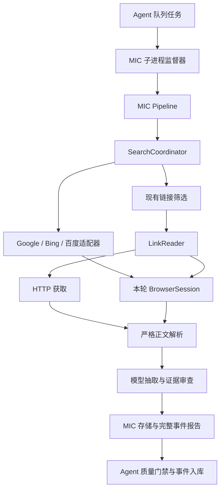

# agents_groups 本地浏览器搜索与正文采集设计

版本：v1.2 · 2026-10-01  
状态：已按本方案实现（归档副本，2026-10-01）。实现差异与验收记录见 README「本地浏览器搜索路线（browser_local）」一节：Bing、百度、Google 选择器均已在本机真实 DOM 上验证并启用（Google 需先用 `mic browser setup --url` 人工通过一次 /sorry/ 验证；其结果链接为 `/goto` 跳转包装，按 `pending_redirect` 处理）；在线验收不进入 CI。2026-10-02 代码审核后补齐：第 10.1 节 `interactive` 模式（保持页面、限时重新观察）、
第 8 节进程组级回收与统一硬时限、第 6.3 节读取候选相关性闸门、第 10.3 节注入 Cookie 有效期截短与启动时清理，均已实现并有测试。  
适用项目：[apollos/agents_groups](https://github.com/apollos/agents_groups)  
建议归档位置：`docs/design/local_browser_search.md`

阅读顺序：先看第1–4节确定范围和结构，再按第5–15节实现接口、运行与数据链路，最后用第16–19节组织测试、提交和review。第13节配置全部为待实现示例。

v1.1 更新：集中说明 MIC 与 Agent 的修改分工，并明确先完成工具独立验收、再接入 Agent 的两阶段实施顺序；技术目标、预算和证据门槛不变。

v1.2 更新：增加用户授权的 Cookie／会话 fallback，补齐本机导入、作用域、一次重试、失效撤销、配置与测试；沿用原有总预算和证据门槛。

## 1. 设计结论

为 MIC 增加 `browser` 搜索提供方，使用 Ubuntu 图形桌面上的独立、有窗口 Edge，通过 Playwright 操作 Google、Bing、百度的正常搜索页面。提取自然搜索结果，再接入现有的筛选、正文读取、模型抽取、证据审查、存储与 Agent 队列。

### 1.1 主要改哪个项目

**主要修改 `tools/market_intelligence_collector` 工具；`agents/intelligence_collector_agent` 做配套接入。MIC 实现采集能力，Agent 负责任务编排。**

| 功能 | 实现归属 | 边界 |
|---|---|---|
| Edge 搜索 Google、Bing、百度 | MIC | 引擎适配器和浏览器资源管理放在工具中 |
| 结果解析、翻页、去重、相关性判断、引擎切换 | MIC | Agent 不实现或复制搜索引擎逻辑 |
| 浏览器获取正文、验证页识别、正文范围检查 | MIC | HTTP 与浏览器结果统一进入现有严格解析 |
| 搜索/读取/模型预算的实际计数与拒绝超额操作 | MIC | Agent 传入任务预算，工具在执行边界落实 |
| 浏览器配置、来源记录、证据审查、缓存和 MIC 存储 | MIC | 不依赖 Agent 包，可通过工具入口独立使用 |
| 用户授权 Cookie 的导入、会话复用和受限重试 | MIC | 只读取本机显式配置的凭据来源，Agent与模型不接收Cookie值 |
| 通用 worker 入口、浏览器关闭、超时终止与 profile 锁 | MIC 的运行支持模块 | MIC CLI 与 Agent 调用端复用，不重复实现两套生命周期 |
| 任务发起、调度、队列租约、取消与重复消息处理 | Agent | 调用 MIC 执行入口并管理任务归属；与通用运行模块配合 |
| 结果是否可用、完整事件传递与 Agent 入库 | Agent | 保留已有空产出门禁与证据字段修复 |
| 按 provider 做环境预检的 Skill | Agent 的 Skill 生成模板 | 调用 MIC 提供的 doctor/preflight，不在 Skill 内复制浏览器脚本 |

依赖方向保持为 **Agent → MIC**。MIC 不导入 `agent_trade_intel`，不要求 Agent 队列才能搜索或读取网页。独立运行 MIC 的模型分析阶段仍使用已配置的模型服务；“工具独立运行”不等于取消模型 Gateway。

### 1.2 两阶段开发与验收

**阶段 A：先完成 MIC 工具。** 实现浏览器资源、搜索适配器、预算、正文获取、证据记录和通用运行入口；依次验收纯搜索、单网页正文、MIC 自身的采集与存储。纯搜索和正文检查不调用模型。阶段 A 的验收不需要启动 intelligence_collector_agent。

**阶段 B：再完成 Agent 配套接入。** 修改 MICAdapter 的执行方式，接入超时终止、取消、租约与重复任务处理；调整 Skill 预检；通过 Agent 队列到事件入库的新隔离库端到端验收。

阶段 A 完成代表工具能力可用；完整设计交付仍包括阶段 B。具体提交拆分见第17节。

### 1.3 默认运行行为

采用以下默认行为：

- 一个专用、持久的浏览器配置目录；同一时刻只允许一个采集任务使用。
- 支持用户正常浏览后提供的有效 Cookie／会话作为可选 fallback；优先在专用浏览器内完成登录或验证，导入外部 Cookie 时限定网站和本地存储范围。
- 从第一页开始；候选不足时翻页，相关性明显不足或引擎不可用时切换引擎。
- 每条查询默认最多访问三张搜索结果页，包含翻页、备用引擎与重试；不是每个引擎各三页。
- 搜索结果按规则解析，不为每个页面截图调用模型。摘要只用于选链接；结构化事实必须来自成功读取且范围明确的正文。
- 搜索和正文读取共享本轮浏览器资源，但保持两个独立接口、预算和失败状态。
- 每次 Agent 采集使用可终止的 MIC 子进程，明确处理超时、窗口关闭、配置目录锁与队列租约。
- 保留 SearXNG/API 提供方作为可配置选项。启用浏览器模式时，不依赖 Docker 或 SearXNG。

这一方案适合本地、低并发、可观察的研究采集。浏览器搜索通常不产生搜索 API 费用，但后续 DeepSeek 分析仍计费。是否比当前 SearXNG 成功率高，需要在你的网络和实际查询上对照验证；有 GUI 不保证不出现验证码，也不能解决网络不可达。[R1]

## 2. 设计依据与版本边界

### 2.1 已确认的运行环境

| 项目 | 当前环境或已回传结果 |
|---|---|
| 源码 | 本仓库工作副本，有本轮调试形成的本地补丁 |
| Python | `<venv>/bin/python`，Python 3.12.3 |
| 隔离工作区 | `<test-workspace>`（仓库外） |
| 测试入口 | `<test-workspace>/bin/run-test` |
| 模型入口 | `http://127.0.0.1:18791/v1`，MIC 路由 `openclaw/main` |
| 实际主模型 | `deepseek/deepseek-v4-flash`，MIC 输出上限已调至 16384 |
| 浏览器 | 独立有窗口 Edge 已成功读取过目标文章；此前为测试脚本接入 |
| 质量配置 | `MIC_ALLOW_MOCK=false`；`strict_evidence_review=true`；结构化最低分 70 |
| 搜索现状 | Bing 曾返回相关结果，也多次返回偏离目标的结果；Google/百度出现过验证码；Sogou 出现响应适配错误 |

本设计基于对话中的真实报告、可用的 MIC/Agent 源码快照以及后续正文范围修复。当前 GitHub 页面未能通过检索工具读取，因此不宣称已核对远端最新 HEAD。实施前应确认下面列出的函数与本地当前版本一致，已有补丁先形成清晰基线，避免旧快照覆盖新修复。

### 2.2 现有代码与需要改变的接点

以下 MIC 路径相对于 `tools/market_intelligence_collector/`；Agent 路径相对于 `agents/intelligence_collector_agent/src/agent_trade_intel/`。

| 现有位置 | 当前能力或缺口 | 本次设计要求 |
|---|---|---|
| `mic/search.py`：`SearchProvider.search()` | 返回 `list[SearchHit]`，缺少页面状态、预算与翻页上下文 | 增加带运行上下文的搜索结果契约，保留旧提供方兼容入口 |
| `mic/search.py`：`FallbackSearchProvider` | 异常或零结果才切换，非零但跑题不会切换 | 浏览器路线使用明确的页面质量调度器，避免外层再套一层隐式 fallback |
| `mic/pipeline.py`：`Pipeline._execute()` | 生成查询、搜索、规则筛选、批量模型筛选、读取与抽取 | 注入同一个运行资源与预算上下文；保存搜索尝试和页面质量 |
| `mic/reader.py`：`LinkReader` | HTTP 抓取与正文解析耦合；浏览器备用读取尚未形成正式接口 | 分离获取页面与解析正文，复用严格范围和反验证页检查 |
| `mic/article_scope.py` | 已有正文范围识别及推荐区边界规则 | 保留；浏览器结果必须继续通过这里 |
| `mic/config.py` | 固定 YAML 文件列表；`MICConfig` 读取各根节点 | 增加受校验的浏览器配置；旧配置可继续加载 |
| `mic/schemas.py`：`SearchHit` | query/title/snippet/url/domain/rank/provider 等 | 追加可选发现元数据，不替换原有字段 |
| `mic/store/models.py`、`repository.py` | 来源链接已有 metadata；读取尝试诊断字段有限 | 增加搜索尝试表，持久保存正文范围和浏览器获取诊断 |
| `adapters/mic_adapter.py` | 在调用线程创建 API，再交给线程池执行；超时只停止等待 | 改为受监督的采集子进程；浏览器创建、使用和关闭归同一执行主体 |
| Agent 质量门禁与事件导出 | 已区分执行成功和空产出；已贯通证据字段 | 保持，不把浏览器打开成功当作业务成功 |
| Agent OpenClaw skill 生成模板 | 已加入搜索服务预检 | 按 provider 分支预检；浏览器模式不启动 SearXNG |

### 2.3 不得回退的已有修复

必须保留金额归一及幂等性、关系/风险/催化剂待核查隔离、原始模型 JSON、SQLite 证据字段、Agent 完整事件传递、空产出门禁、70 分门槛、严格正文范围与推荐区截断。

当前已验证的文章容器是 `#article_cont .cc-article`。它只证明这一网站样本的容器匹配，不是通用网页规则。旧样本中“19461.6 万元 / 360MWh”与引述“0.518 元/Wh”的口径疑点、跨段日期和主体归属问题，不能因为换了浏览器而自动视为已解决。

## 3. 范围与交付边界

### 首版必须完成

1. 有窗口 Edge 的专用配置目录、互斥使用与可终止生命周期。
2. Bing、Google、百度三个独立搜索适配器；每个可单独启停、验收。未通过真实验收的引擎默认不启用。
3. 第一页与最多三页的有界搜索；页面异常识别、去重、目标相关性诊断和切换。
4. 统一的 HTTP/浏览器正文获取接口，继续使用现有严格正文解析。
5. 可追溯搜索与正文诊断、预算计数、Agent 接入及新隔离库端到端验证。
6. provider 感知的 doctor/preflight，以及安装、操作和故障恢复文档。

### 首版不做

- 浏览器集群、并发抓取、云端浏览器、常驻浏览器守护服务。
- 用模型逐步控制鼠标键盘或分析每张搜索截图。
- 自动解验证码、隐身指纹、代理轮换、绕过登录或付费墙。
- 自动改写模型提示词、评分门槛或业务证据标准。
- 默认抓取所有结果的前三页、默认打开全部搜索结果。
- 自动重写历史业务库或历史分析结果。

关键词改写、引擎效果学习、带证据的跨段语义归并、截图/OCR 搜索解析均留到后续独立变更。

## 4. 总体架构



图中的浏览器提供两类页面：搜索页交给引擎适配器，文章页交给严格正文解析器；不得将搜索页面正文送进业务抽取器。

模块职责：

| 模块 | 负责 | 不负责 |
|---|---|---|
| `BrowserSession` | 专用 context、标签页、导航、关闭、状态报告 | 业务相关性、模型、写业务对象 |
| `EngineAdapter` | 正常搜索入口、结果卡片、翻页控件、页面状态 | 选择备用引擎、扩大预算、判定业务事实 |
| `SearchCoordinator` | 页面预算、引擎顺序、相关性、去重、停止条件 | 正文抽取与模型分析 |
| `LinkReader` | 获取策略、正文范围、段落、来源状态 | 搜索关键词规划 |
| `RunBudget` | 单一计数入口、截止时间、拒绝超额操作 | 根据网页内容自行提高限额 |
| `RunSupervisor` | 子进程、取消、回收、队列生命周期 | 解析页面 |

OpenClaw在本方案中继续承担现有模型Gateway职责。浏览器由MIC的确定性工具代码管理，不交给模型逐步操作；这样页面尝试、正文获取与模型调用可以分别计数。以后若增加其他浏览器控制后端，应实现相同的获取契约，不能同时让两个系统争用同一profile。

建议新增 `mic/browser/` 包，包含 `session.py`、`contracts.py`、`engines/{bing,google,baidu}.py`。搜索协调器放在 `mic/browser_search.py` 或独立 `mic/search_coordinator.py`；保留 `mic/search.py` 作为现有提供方工厂与兼容入口。避免为目录整洁先大规模搬迁旧代码。

## 5. 数据与接口契约

以下类型和方法是拟新增接口，不是现有可调用命令或代码。

### 5.1 运行上下文

`RunContext` 包含：

- `run_id`、`attempt_id`、`config_fingerprint`、`artifact_dir`。
- 目标身份上下文：正式名称、明确别名、股票代码、已配置的官方域名；与产业链关联词分开。
- `RunBudget`、单调时钟 deadline、取消标志。
- 延迟创建的 `BrowserSession`；只在本轮所属子进程中访问。
- 搜索/正文尝试记录器，能在失败时保留部分诊断。

不得把 Playwright 对象、数据库 session 或打开的 HTTP client 从父进程传入。只传可序列化配置路径、请求、运行标识；认证从子进程的既有环境或受限配置读取，不写入请求 JSON。

### 5.2 搜索页结果 `SearchPageResult`

| 字段 | 语义 |
|---|---|
| `engine`, `adapter_version` | 实际引擎与解析规则版本 |
| `query_requested`, `query_observed` | 发送词与页面搜索框/可识别回显；无法确认时 observed 为 null |
| `query_match_status` | exact / corrected / unknown / mismatch；只做已定义的空白和 Unicode 规范化 |
| `page_index`, `page_attempt_id` | 引擎内部从 1 开始的页面编号、全局唯一尝试 ID |
| `requested_url`, `final_url` | 导航前后地址；不包含 Cookie 或认证头 |
| `status` | 下方页面状态枚举 |
| `hits` | 解析出的自然结果，按原始页内顺序 |
| `next_page` | 从当前页面确认的下一页链接/控件描述；不可执行代码 |
| `page_fingerprint` | 有序结果定位信息的摘要，用于识别重复页 |
| `diagnostics` | 原始卡片数、有效/广告/去重/丢弃数、异常原因、耗时 |

状态至少区分：`ok`、`no_results`、`captcha`、`login_required`、`consent_required`、`network_error`、`timeout`、`parse_error`、`query_mismatch`、`browser_closed`。HTTP 200 本身不能决定状态。

`no_results` 必须有可识别的正常“无结果”页面依据；找不到结果容器只能报告 `parse_error`。页面虽解析成功但结果跑题，保持 `status=ok`，另外标注 `relevance=low`，以区分网页错误和搜索质量。

### 5.3 扩展 `SearchHit`

现有必需字段与默认值不变，追加可选 `discovery: dict`，首版定义稳定键：

```json
{
  "engine": "bing",
  "page_index": 1,
  "rank_in_page": 3,
  "page_attempt_id": "search_attempt_example",
  "adapter_version": "bing-dom-v1",
  "retrieved_at": "2026-10-01T12:00:00Z",
  "raw_href": "https://example.com/news/123",
  "url_resolution": "direct",
  "display_url": "example.com/news/123",
  "date_text": null,
  "result_kind": "organic"
}
```

`provider` 使用 `browser:bing`、`browser:google`、`browser:baidu`。旧 `rank` 表示该引擎本查询已返回自然结果的累计顺位，不计算广告；原始页内序号另存，不假定每页十条。

`date_text` 保留页面原文；不能可靠解析的日期不塞入 `publish_time_guess`。snippet、日期猜测与搜索平台摘要都不构成正文证据。

### 5.4 新旧搜索入口兼容

新增 `search_with_context(request, context) -> SearchBatch`。`SearchBatch` 返回 hits、page_attempts、查询级 outcome、stop_reason 和质量统计。

- 旧提供方默认实现可以委托现有 `search(query, query_family, limit)`；旧 provider 的外部 API 请求另记计数，不能伪称浏览器页数。
- 浏览器提供方实现完整协调流程。`Pipeline` 调用此入口，接收诊断。
- 保留 `search()` 供已有调用方使用。浏览器的兼容调用只执行“一个引擎、一页、受限临时运行上下文”，自行关闭资源；不进行隐式多引擎扩展。文档注明此入口无法返回完整失败诊断。
- `limit` 是本查询返回的结果总上限，不是每页限额。新增独立 `results_per_page_cap`。
- 浏览器模式配置外层 `fallback: []`；首版拒绝同时配置旧复合 provider 和浏览器内部多引擎调度，防止预算被多层包装重复消耗。
- provider 构造和配置校验不能打开浏览器、请求网页或调用模型。读取已存事件同样不启动任何采集服务。

## 6. 搜索策略：第一页到前三页

### 6.1 标准流程

1. QueryPlanner 生成原有任务查询，保留 `query_family`、语言与优先级。
2. 协调器选择当前配置中第一个可用引擎；不能因某引擎被禁用而静默启用未配置引擎。
3. 预算预占成功后加载第一页，等待结果、无结果、验证或错误状态之一。
4. 引擎适配器解析有界数量的自然结果；做链接规范化和本轮去重，保留每次发现记录。
5. 计算目标匹配、任务匹配、正文候选数与新增链接数。
6. 候选充分则结束本查询；不足时按下一节决定翻页或切换。
7. 返回全部有效发现及诊断，接入 MIC 原有 triage。页面相关性规则不自动把链接提升成 `read`。
8. 完成有界搜索后，统一对候选进行现有规则/模型筛选，最多读取配置数量的文章。

首版不在浏览器模块偷偷生成新查询。将来引入加引号、英文别名等改写时，应由 QueryPlanner 输出独立、有预算的查询并记录来源。

### 6.2 翻页与切换决策

建议起始配置：目标正文候选数 2，单查询最多 3 页、最多 2 个引擎；引擎适配器本身支持继续翻页到第 3 页。

| 当前结果 | 动作 |
|---|---|
| 已有至少 2 条去重后的目标相关正文候选 | 停止本查询 |
| 有相关正文候选，未达到 2 条，且有合法下一页 | 当前引擎下一页 |
| 没有目标命中，或只有企业首页/目录/地图等 | 优先切换到下一个已启用引擎的第一页 |
| 明确无结果 | 切换引擎；若没有备用则正常结束为空 |
| CAPTCHA/登录页 | 若有适用且本次尚未尝试的用户授权会话，先做一次有预算的恢复；否则进入人工处理策略或标记不可用并切换 |
| 同意页 | 按人工处理策略处理；不能通过导入或修改Cookie伪造用户同意 |
| 页面解析失败、查询不一致、网络失败 | 记录具体原因；默认不重试同页，尝试备用引擎 |
| 页指纹重复或没有新链接 | 停止当前引擎翻页；有剩余预算时可换引擎 |
| 没有下一页 | 停止该引擎；候选不足时可换引擎 |
| 预算/时间耗尽 | 停止并返回已获得结果，不补发请求 |

示例：Bing 第一页 + Bing 第二页 + Google 第一页 = 3 页，已经耗尽该查询预算。Bing 验证页也消耗一次页面尝试。不能再以“重试不算”额外打开页面。

如任务明确只用一个引擎，可设置 `max_engines_per_query=1`，正常查看这个引擎的前 1–3 页。三个引擎全部查看三页属于另外一种高预算任务，不是默认行为。

### 6.3 相关性规则

页面质量使用可解释规则，不先花模型调用：

- 目标身份匹配：完整实体名、可信别名或有适当上下文的股票代码。中文“宁德”不能替代“宁德时代”；客户、竞争对手、行业词不能自动算作目标主体命中。
- 任务匹配：来自现有 query family 的业务词及同义词，例如中标、订单、供货、采购。规则版本必须记录。
- 内容形态：文章/公告候选优先；首页、百科、地图、招聘、泛目录降低候选资格，仍可保留为链接。
- 官方域名提高来源识别可信度，但不能仅因官方首页而认为已找到中标新闻。
- `site:` 明确约束应按实际目标主机严格核对。主机比较必须区分 `catl.com`、其子域和 `catl.com.evil.example`。尚未解析最终 URL 时记录 unknown，不把展示域名当作已确认。

记录 `target_match_count`、`task_match_count`、`relevant_article_count`、`unique_new_count`、`off_topic_examples`。首版不设置一个不透明“综合分”替代现有 triage，也不降低当前阅读或入库门槛。

## 7. 三个引擎的适配边界

| 引擎 | 首版实现要求 | 特别注意 |
|---|---|---|
| Bing | 普通搜索页，提取自然结果卡片；已观察 `#b_results > li.b_algo` 可作为候选规则 | 这是版本化选择器，不是永远稳定的 API；保留编码跳转链接与查询回显诊断 |
| Google | 普通网页结果，按可见标题链接及其所属结果卡片解析 | 排除广告、AI 摘要、知识面板、相关问题、视频/购物组件；同意页和验证页单独识别 |
| 百度 | 普通网页结果，自然卡片标题、摘要、展示域名和原始链接 | 区分广告、聚合模块、站内内容和外部结果；跳转链接常不能直接当作目标域名 |

实现 Google、百度前，分别获取本机正常结果页的最小脱敏 DOM fixture，再确定选择器；本设计不编造已经验证的 CSS 路径。每个适配器必须支持“页面结构不认识”的明确失败，不能全页扫描所有 `a` 标签作为兜底。

页面就绪采用结果/空结果/挑战等特征的有界等待。不要用固定睡 15 秒作为成功条件，也不要把整页 `networkidle` 当作唯一条件；搜索页可能持续有网络活动。

下一页来自当前页面已识别控件或链接，校验引擎域名、查询身份、页码推进与已访问指纹。首版不自行拼接未经验证的页码参数。若使用“加载更多”，每个新增结果批次消耗一页预算，并记录 `pagination_kind=load_more`。

只允许正常公开搜索页面与 HTTP(S) 结果地址。丢弃 `javascript:`、`file:` 等链接；页面文字不能指挥程序运行命令、更改配置或跳转本机管理接口。

### 链接规范化与跳转

- 保留 `raw_href`，输出可直接确定的目标 URL；仅去除已知追踪参数，不能随意去掉承载文章身份的查询参数。
- 能按已确认编码规则本地解码的链接可解码；不为全部结果额外发请求解析跳转。
- 无法离线解析的跳转链接标记 `url_resolution=pending`，使用临时发现键去重；不伪造最终主机。
- 被选入正文读取后，在这次有预算的导航里取得最终 URL，再更新 canonical URL 与来源主机。重复目标只分析一次，但发现记录全部保留。
- 广告必须从结果卡片类型识别并排除，不能只凭跳转域名判断广告与否。

## 8. 浏览器生命周期与执行模型

### 8.1 选择独立持久配置目录

默认 Edge `channel=msedge`、`headless=false`，配置目录在测试工作区下，例如 `browser/profiles/mic-edge`。正常结束关闭窗口，但保留 Cookie/本地存储，下一轮复用。不要连接用户日常 Edge 的主配置目录，也不默认开启一个长期暴露的调试端口。

Playwright 支持持久 context 和 Edge channel；同一 user data directory 不能同时启动多个浏览器实例。[R2] 因此需要应用级互斥锁，并保留浏览器自己的锁机制。

锁至少记录 run/attempt、PID、进程启动身份、创建时间。Ubuntu 使用操作系统文件锁保证互斥；锁文件内容只是诊断，不以“文件存在”判断进程存活。遇到占用返回 `profile_busy`。不得自动删除 Chromium 的 Singleton 锁，或按进程名称关闭用户其他浏览器。

profile 目录权限 0700；诊断文件 0600。浏览器状态可能含登录凭据，不提交 Git，不上传到运行报告。[R3]

### 8.2 用子进程替代不可终止的采集线程

现有 `Future.result(timeout=...)` 只终止等待，`executor.shutdown(wait=False)` 不会终止采集。接入浏览器后，不能继续把这叫作硬超时。Playwright API 也不保证线程安全。[R4]

首版采用：一个 MIC 采集任务对应一个受监督子进程，子进程内部串行使用同步 Playwright。

父进程：

1. 校验请求、分配稳定 task/idempotency key 与 attempt ID，创建受限运行目录。
2. 使用当前工具解释器 `sys.executable` 启动内部 worker 入口；Ubuntu 使用独立进程组。参数用列表传递，不经 shell 拼接。
3. 通过受限 JSON 请求文件/管道传业务参数；子进程自行加载指定 MIC 配置。stdout/stderr 用于日志，最终结果用单独 JSON 文件，临时写后原子替换。
4. 维持任务租约和取消状态，监听完成、异常退出与总 deadline。
5. 正常完成先确认子进程退出，再读取并校验结果。
6. 超时/取消时先请求协作停止并发送 TERM；5 秒内未退出再 KILL 本轮拥有的进程组；回收后才结束任务。清理宽限可在 300 秒业务期限之外最多再占 5 秒。
7. 清理失败时返回 `cleanup_incomplete` 并阻止同 profile 自动重试，不宣称资源已释放。

子进程：

- 在自己所属线程创建 AnalystAPI、数据库连接、HTTP client 和 BrowserSession；不在父进程创建后传递。
- 构造资源时延迟启动浏览器；每轮只启动一次 context，搜索/正文使用独立标签页并及时关闭。
- 任何异常走 finally 关闭 page/context/Playwright/数据库资源；不能仅依赖 finally，强制杀进程仍由监督器兜底。
- 信号处理器只设置取消标志，正常执行路径负责关闭，避免在信号处理器直接重入 Playwright。
- 在搜索、正文、模型发送和持久化边界检查取消、deadline 与任务归属；页面内容不能延长任务期限。

父子进程使用同一实际总时限：取Agent适配器超时、部署上限和任务预算的最小值。父进程记录启动时刻，子进程拿到扣除启动开销后的剩余期限；不能让父进程300秒退出、子进程仍按原900秒设置继续运行。

### 8.3 队列租约与重复任务

父进程必须在子进程运行时持续持有/续期队列租约；若租约丢失，立即取消子进程。并发消费者不应因旧租约过期立即启动相同 profile 的第二轮。

至少增加稳定 task key、attempt token 与唯一活动运行约束。业务写入在事务内检查 attempt 是否仍有效；被撤销的旧 attempt 不得继续导出事件。历史已完成且部分提交的记录保留为该次运行的部分结果，不伪装成完整成功。

可新增 `collection_attempt` 控制记录：`task_key`、`attempt_id`、`owner_token`、`worker_pid`、`worker_started_at`、`state`、`heartbeat_at`、`deadline_at`、`result_path`。状态为 starting/running/cancelling/completed/failed/interrupted；活动唯一约束按task key建立，profile互斥仍由独立资源锁保证。原有队列数据库若已有等价的可靠机制可复用，但必须通过租约丢失和重复投递测试，不能仅依赖进程内布尔变量。

子进程被强制结束后，已发送到远端 Gateway 的请求可能仍在服务端完成或计费；进程终止只能保证不再发送新请求，不能承诺撤回已发送请求。报告必须如实记录已发送次数及响应未知状态。

若父进程异常退出，worker 应监测父进程/心跳失联并停止；下次 doctor 检测遗留运行。清理仅基于已验证归属，不使用 `pkill edge` 或 `pkill openclaw`。

## 9. 单一预算与停止规则

有效预算是任务请求值、部署上限与剩余时间的较小值。禁止网页、模型结果或 fallback 自行扩大。所有对外操作在发送前预占；失败也计数，未发送不计数。

建议首次端到端验收配置：

| 计数/限制 | 建议值 | 定义 |
|---|---:|---|
| `max_queries` | 2 | QueryPlanner 输出的独立查询，沿用现有键 |
| `max_search_pages_per_query` | 3 | 同查询所有引擎、翻页和显式重试合计 |
| `max_search_pages_per_run` | 6 | 全运行搜索页面尝试总数 |
| `max_engines_per_query` | 2 | 最多尝试的不同引擎 |
| `results_per_page_cap` | 10 | 每张页面最多接收的自然结果；页面可能不足十条 |
| `max_hits_per_query` | 30 | 跨页合计返回上限，对接现有 provider limit |
| `max_search_hits` | 60 | 全运行发现条目上限，重复也占发现计数 |
| `max_links_to_read` | 2 | 被选择进行正文获取的唯一候选 URL 数；不是成功数 |
| `max_http_read_attempts` | 2 | HTTP 正文请求尝试数 |
| `max_browser_read_attempts` | 2 | 浏览器正文导航尝试数 |
| `max_authenticated_retries_per_origin` | 1 | 同一origin本轮最多一次授权会话恢复重试；不是新增的页面额度 |
| `max_authenticated_retries_per_run` | 1 | 本轮所有origin合计的授权会话恢复重试上限 |
| `max_model_calls` | 3 | 沿用 MIC 模型任务预算 |
| `max_gateway_requests` | 3 | 新增实际 MIC→Gateway HTTP 请求硬限额 |
| `max_run_seconds` | 300 | 排队获得运行权后，worker 启动至采集终止的墙钟期限 |
| `max_page_seconds` | 25 | 单页导航与内容就绪合计上限，受剩余总时限约束 |
| `min_engine_interval_seconds` | 3 | 同一引擎的最小访问间隔，属于节制访问配置，不保证避免验证码 |
| `max_retries_per_page` | 0 | 默认不自动重试；启用时仍消耗页面尝试预算 |

读取方式 `http_then_browser` 下，常规路径一条候选最多占一次 HTTP 和一次浏览器尝试。v1.2允许在第10.2节条件满足时，为同一候选增加一次授权会话重试，但仍从原有 HTTP／浏览器总额度中扣除，不额外获得额度。示例：某网址先HTTP失败、再浏览器失败，随后导入有效Cookie重试浏览器，已经用完本轮2次浏览器正文尝试；下一条候选不能再启动浏览器获取。两条候选全运行仍最多2次HTTP加2次浏览器尝试。浏览器模式直接读取成功则不再发HTTP。

`max_retries_per_page=0`指无会话变化的普通重试；授权会话恢复使用上述独立子限额，同时受原页面总额约束。搜索会话恢复同时占一次 `search_page_attempts`，正文会话恢复占一次对应读取尝试；不能仅增加一个auth计数而漏掉实际导航计数。

搜索页重载、显式刷新和重试计新的搜索页面尝试。一次导航内的普通重定向不算新搜索页，需受 redirect/时间上限约束。图片、JS、字体等子资源不算逻辑页数，报告应明确这一口径，不能声称“只发生六次网络请求”。

正常的节制等待、人工等待和资源启动都消耗总时限；页面独立 timeout 不能在每次 fallback 时重新获得完整 300 秒。通过可注入时钟测试，不用真实睡眠验证预算。

模型计数在正式 HTTP 发送入口执行，SDK 重试关闭；批量筛选、抽取、级联和仲裁都共享上限。不得为 doctor 或每个引擎预检消耗一次额外模型调用。Gateway 内部提供方重试不在 MIC 可控制的请求计数内，应单独说明。

新增 `queries_attempted`、`queries_completed`、`search_page_attempts`、`http_read_attempts`、`browser_read_attempts`、`gateway_requests_sent` 等明确统计；保留旧 summary 字段并说明旧 `queries_executed` 的兼容含义，不在同一次变更里静默更换报表含义。

## 10. 验证码、登录和人工接管

### 10.1 交互模式

首版分两种运行模式：

| 模式 | 行为 |
|---|---|
| `unattended`，Agent 默认 | captcha/login可先尝试第10.2节中已授权、适用的本机会话；仍被阻挡或无适用会话则记录unavailable并按预算换引擎；consent不自动处理，不等待无人处理的窗口 |
| `interactive`，桌面调试显式启用 | 输出等待原因并保留当前窗口，允许用户自行正常操作；限时重新观察页面状态 |

互动等待建议最多 60 秒，并计入总运行时间。程序不填写密码、不拖动验证码、不调用识别服务。用户完成操作后，重新检查实际页面与查询；不能仅收到“继续”就当作成功。若恢复过程需要程序再导航，消耗新的页面尝试预算；仅重新观察已经加载的 DOM 不消耗导航次数。

已打开的页面具有可阅读正文，同时存在非阻挡提示时，必须记录提示与正文可见性；不能通过删除遮罩、隐藏验证组件或读取访问被禁止的隐藏 DOM 来宣称读取成功。整个页面为挑战页、正文不可见或需要授权才能显示时，返回阻塞状态。

手动预先登录可以通过独立的 browser setup 命令完成，使用同一专用 profile、互斥锁与正常关闭流程。自动运行不得连接另一位用户正在操作的浏览器实例。

### 10.2 用户授权的 Cookie／会话 fallback

用户可以提供自己正常浏览、登录或完成验证后取得的Cookie，供MIC在相同网站再次尝试。该能力属于MIC的可选会话恢复模块，不把凭据交给Agent或模型。

**推荐方式：专用profile正常浏览。** 通过 `browser setup` 打开MIC专用Edge，用户按需完成网站操作，正常关闭后由后续MIC任务复用现有状态。这样无需手工复制Cookie，也能保留该profile内的网站本地存储。

**补充方式：本机导入Cookie文件。** 用户从自己的浏览器导出指定网站Cookie，通过MIC的本地导入命令登记。首版支持明确版本的JSON格式：Cookie对象数组，字段与Playwright `add_cookies` 所需的name/value、url或domain/path、有效期和安全属性对应。[R5] 导入器必须校验格式，不能把任意JSON猜测为可用凭据。

- 本地导入只读取用户明确指定的文件，不扫描、解密或复制日常浏览器整个配置目录。
- 注册 `credential_id`、非敏感版本号、目标origin、允许的Cookie域范围、导入时间和本地失效时间；实际值存于仓库外的受限凭据目录。
- Cookie的domain/path、Secure、HttpOnly、SameSite及支持的分区信息必须保留或明确拒绝不支持格式。不得为求可用而扩大域范围、关闭Secure或延长站点给定的expires。
- host-only与domain-cookie不能随意互换；导出格式不能明确区分且存在歧义时拒绝导入并提示使用专用profile。拒绝公共后缀或超出授权范围的domain；广域Cookie需要显式允许其真实域范围，不能仅凭请求地址强行认定同域安全。
- `allowed_origins`控制在哪个站点启用哪份凭据，不代替浏览器自身的Cookie域/路径发送规则。跨站跳转不得拷贝Cookie值到新站点，也不得把整串Cookie放进全局请求头。
- JSON中的完整 `storage_state` 可能还有localStorage/IndexedDB等内容。首版Cookie导入接口不声称支持完整状态；遇到非Cookie状态必须明确提示不支持，推荐在专用profile内正常登录。[R3]
- Cookie默认只注入MIC专用浏览器context；**首版不自动把浏览器Cookie复制到httpx请求中**。将来确有网站需要HTTP会话复用时，单独设计带域/路径校验的Cookie jar并验证重定向行为，不能拼接通用Cookie头。

恢复条件：遇到 `anti_bot_page`、`captcha` 或 `login_required` 等可识别会话问题，用户已启用该origin的fallback，有未过期的授权凭据，而且该凭据版本尚未在当前失败尝试中使用。仅有403、超时或解析错误不足以自动判定应加载账号会话；404/410、无关结果和正文容器错误不触发Cookie重试。

流程为：普通获取失败 → 检查会话适用性 → 预占实际页面/读取预算与auth子限额 → 注入或复用更新后的授权会话 → 对原查询/原目标再次导航一次 → 重新检查页面状态、相关性和严格正文范围。已有会话如果已经在失败请求中使用，不能原样加载再冒充新的fallback。

同origin本轮最多一次，全运行默认最多一次；包括失败尝试。用户在运行中更新凭据也不重置预算。仍出现验证时保持blocked，交互模式可请用户操作，无人值守则切换引擎/来源或结束。不能因为“Cookie导入成功”就判定网页读取成功，也不能跳过70分与证据审查。

可复用会话不保证跨环境有效。例如Cloudflare说明其验证Cookie与特定访问者/设备有关，并可能在未到期时再次要求验证。[R6] 这只是说明一种技术限制，不代表已确认今天目标网站使用该产品；因此优先在原本机、同一专用浏览器环境内正常使用，而不设计成可任意搬运的通行凭据。

### 10.3 会话保护、失效与审计

凭据文件权限0600，目录0700；实际Cookie值、认证头和完整storage state不进入命令行参数、普通日志、异常对象、模型提示、业务SQLite或Git。用户无需在对话中发送Cookie，只需在自己的Ubuntu机器本地导入。导入、查看状态与删除命令仅展示网站、数量、版本和有效期等元信息。

本地有效期取用户配置上限与Cookie真实有效期的较早值；对于无明确expires的session cookie，必须设置本地有效期，建议默认2小时并允许用户调整。有效期未知或过期不自动续期，只有用户重新授权/导入或正常网站会话更新才能形成新版本。

授权失效/撤销时，停止使用对应凭据，并清理MIC专用profile中该授权范围的导入会话及其受管理后继状态；不能只删外部JSON但让持久profile继续沿用旧身份。跨域或混合账户来源无法可靠隔离时，拒绝混用并要求单独的MIC专用profile。此清理不触及日常浏览器。

搜索与读取诊断增加 `auth_mode`（anonymous/profile/imported_cookie）、`auth_context_id`、`credential_version`、`authenticated_retry` 和恢复结果；这些ID不能直接使用Cookie值。匿名与账号会话的搜索/分析缓存必须分开，不能跨账户复用；会话内的个性化结果也不能标成匿名搜索结果。凭据更新和注销都应更新缓存命名空间。

有凭据页面的完整DOM、HAR和截图默认不保存；确需排查时显式开启受限本地诊断并先脱敏。模型只接收通过正文范围检查的任务相关文本，不接收会话凭据或账号页面组件。

## 11. 正文读取正式接入

### 11.1 获取与解析分开

新增统一 `FetchResult`，至少包含：transport、requested/final URL、HTTP 状态、content type、原始 HTML/bytes（仅内存）、浏览器标题、渲染文本、可见性诊断、耗时、阻塞原因。

`HttpFetcher` 与 `BrowserFetcher` 都返回该结构。之后统一进入现有 LinkReader 的 HTML/PDF 判断、反验证页检查、严格正文范围、推荐段落截断、段落选择与内容 hash。禁止在浏览器路径另写一个“只要 inner_text 非空即成功”的读取器。

`ReadResult` 保留现有字段，增加获取诊断；`body_scope` 必须保存到读取记录，而不只打印在测试脚本里。

### 11.2 策略

默认 `http_then_browser`；对已验证 HTTP 经常返回挑战页的网站可配置 `browser_first`。首版网站规则按主机精确匹配。

- HTTP 正常且严格正文通过：直接返回。
- `anti_bot_page` 或明确需要渲染：在域名策略允许且预算足够时尝试浏览器。
- `article_scope_unresolved`：只有允许 browser rescue 的规则才尝试一次；浏览器仍无法定位则失败，不回退整页。
- 404/410、明确非支持内容、明确拒绝访问：不做无意义浏览器重试。
- 登录/验证码按上一节处理；授权Cookie重试必须返回同一个FetchResult契约，并重新经过完整正文检查。
- PDF 沿用已有读取链路；首版不把浏览器 PDF 查看器文本当成通用 HTML。下载如要支持，必须独立限制大小、类型、保存路径与时间；未实现时返回明确 unsupported。

### 11.3 正文验证与证据

每次成功读取至少记录容器规则版本、body_scope、选中段落、来源最终 URL、提取时间、正文 hash、transport 和可见性检查结果。页面诊断文件和网页文本都视为不可信输入。

目标测试文章应只保留标题与三段项目正文，不能包含“相关阅读”以及外部推荐新闻。保留原文两条报价，不自动重算覆盖。新抓取段落 ID 属于新文档版本，不沿用旧 p4/p5/p6 的编号；模型输出必须引用本轮实际段落集合。

浏览器可见正文范围检查与业务证据审查分别报告。金额、项目主体、日期跨段归属、价格口径仍由已有规则和后续语义审核处理。

## 12. 存储、溯源和缓存

### 12.1 搜索尝试记录

新增 `search_page_attempt` 表，至少包含：

`id`、`search_run_id`、`query_id`、`engine`、`adapter_version`、`page_index`、requested/observed query、requested/final URL、status、error_code、started/finished_at、result_count、new_unique_count、page_fingerprint、quality_json、diagnostics_json。

先创建 attempting 记录，完成后更新；崩溃遗留记录标记 interrupted，不补造结果。检查状态与摘要统计必须能从这些记录重算。

`source_link.metadata` 保存 `discovery`。保留一个 URL 被多个查询/引擎发现的不同记录，读队列按 canonical URL 合并。不要为了去重丢掉发现来源，也不要把同网址重复发现计成多份独立事实佐证。

### 12.2 正文尝试与快照

为 `link_read_attempt` 增加可空 JSON 诊断字段，保存 transport、final_url、scope、parser_version、浏览器等待/阻塞状态、artifact 引用。保存本轮选定段落与正文 hash，可引用现有模型输入存储；不得让证据只存在临时控制台日志中。

默认不把完整DOM、HAR、Cookie或浏览器profile写入运行报告和普通诊断目录。第8节的专用持久profile、第10节的授权凭据仅保存在各自受限位置。调试时可显式保存脱敏最小DOM、截图和段落；设保留期限，位置不在仓库，分享前排除账户信息。在线正常模式只保留足以审计的来源元数据和实际使用的正文证据。

### 12.3 缓存策略

当前 Pipeline 存在先按 canonical URL 复用历史分析的路径。新正文边界生效后，不能绕过新读取而直接复用旧污染内容。

首版浏览器验收强制 `reuse_analysis=false`，使用新隔离库。正式开放缓存前必须满足：

- 分开管理 SERP 缓存、正文缓存和分析缓存，不混用状态。
- 将匿名/授权会话以及非敏感auth_context_id纳入缓存隔离；不同账号或授权版本不互相复用。
- 分析缓存 key 包含 target/task、正文 hash、正文范围规则版本、证据审查/输出 schema 版本、模型与 merge policy 版本；预算和 provider 变化不能把旧数据伪装成本轮抓取。
- URL 级复用还需正文新鲜度与兼容版本检查；缺少版本信息的旧记录不直接复用为严格模式已验收内容。
- 所有复用报告标注原 run、原获取时间和本轮复用，完整证据字段继续传递。
- CAPTCHA/parse_error 不缓存为“正常零结果”。短时引擎冷却状态可以保存，但有独立过期时间。

新增表/字段采用增量、幂等迁移，旧字段不删除。旧数据未知元信息保留 null；不伪造历史 browser transport 或规则版本。迁移与业务读取需用实际 SQLite 副本验收。

## 13. 配置设计

下列 YAML 是拟实现的配置契约，不能直接当作当前程序已支持的配置。保留现有分文件、带根节点的加载方式；新增 `browser_runtime.yaml` 到 `CONFIG_FILES`，新增 `MICConfig.browser_runtime`，并对新配置做类型、范围和未知字段校验。

### 13.1 `search_providers.yaml` 增量示例

```yaml
search_providers:
  active: browser_local
  fallback: []
  max_hits_per_query: 30
  providers:
    browser_local:
      type: browser
      engine_order: [bing, google, baidu]
      enabled_engines: [bing]  # 各引擎真实验收后再逐一开启
      results_per_page_cap: 10
      desired_relevant_articles: 2
      max_retries_per_page: 0
      min_engine_interval_seconds: 3
      query_rewrite: false
```

`engine_order` 只是顺序，不保证引擎可用。首次仅启用完成本机验收的引擎；顺序可以根据实际网络调换，不能未经对照就认定某一个始终更好。

### 13.2 `browser_runtime.yaml` 示例

```yaml
browser_runtime:
  version: 1
  enabled: true
  channel: msedge
  headless: false
  profile_dir_env: MIC_BROWSER_PROFILE_DIR
  interaction_mode: unattended
  human_wait_seconds: 60
  browser_start_timeout_seconds: 20
  page_timeout_seconds: 25
  cleanup_grace_seconds: 5
  max_open_pages: 2
  chromium_sandbox: true
  accept_downloads: false
  session_fallback:
    enabled: false  # 用户配置本机凭据来源后，显式开启
    allowed_origins: []
    cookie_sources: {}
    default_max_age_seconds: 7200
    apply_to_http_client: false
    save_authenticated_page_artifacts: false
  artifacts:
    save_screenshots: on_error
    save_full_dom: false
    retention_days: 7
  limits:
    max_queries: 2
    max_search_pages_per_query: 3
    max_search_pages_per_run: 6
    max_engines_per_query: 2
    max_search_hits: 60
    max_links_to_read: 2
    max_http_read_attempts: 2
    max_browser_read_attempts: 2
    max_authenticated_retries_per_origin: 1
    max_authenticated_retries_per_run: 1
    max_model_calls: 3
    max_gateway_requests: 3
    max_run_seconds: 300
  cache:
    reuse_analysis: false
```

`limits` 是当前开发部署上限，不是以后所有生产任务的固定规模。任务的 `budget_profile` 可以进一步收紧，不能扩大；今后批量任务需要显式变更部署配置。

`MIC_BROWSER_PROFILE_DIR` 由本地启动器设置，例如测试工作区的 `browser/profiles/mic-edge`；未设置则配置失败，不根据当前 cwd 随机创建。报告只记录 profile 标识或受控路径，不包含内容。渠道与 Playwright 版本记录到运行诊断；浏览器缺失时输出安装提示，不自动升级系统浏览器。

网络默认使用正常系统网络环境，不从 Docker 旧配置推导代理。不在仓库硬编码 `127.0.0.1:20112`。如需显式代理，单独提供部署配置；HTTP 与浏览器的路由差异要可诊断，但不得输出代理凭据。Gateway 访问继续遵循现有本地直连配置。

### 13.3 `access_profiles.yaml` 拟新增配置

```yaml
access_profiles:
  browser_fetch:
    default_mode: http_then_browser
    fallback_reasons: [anti_bot_page, rendering_required]
    site_rules:
      news.bjx.com.cn:
        mode: browser_first
        allow_scope_retry: true
```

该新增块与原有 `access_profiles.default` 并存，不覆盖既有 timeout、段落上限与 user-agent 设置。通用 fallback 不代表允许任何网站无限次尝试。

### 13.4 配置优先级

1. 已校验的部署配置确定可用引擎、资源目录和硬上限。
2. task_profile 只在允许范围内选择子集、收紧预算。
3. CLI 调试参数可切换 interactive、打开诊断，但不能隐式关闭严格证据审查。
4. `MIC_ALLOW_MOCK=false`、模型认证与既有数据库环境变量继续使用原机制。

把合并后的非敏感配置和 fingerprint 写入报告。配置错误应在导航前失败；不能把拼错 browser 字段默默忽略后继续跑默认80条查询。

### 13.5 授权Cookie来源配置示例

下面仅为合并到上文 `browser_runtime.session_fallback` 的增量示例，不包含真实Cookie。origin与域名仅演示本轮目标网站，不能自动授权所有网站。

```yaml
browser_runtime:
  session_fallback:
    enabled: true
    allowed_origins: ["https://news.bjx.com.cn"]
    cookie_sources:
      "https://news.bjx.com.cn":
        credential_id: bjx_user_session
        format: playwright_cookies_json_v1
        source_file_env: MIC_BJX_COOKIE_FILE
        allowed_cookie_domains: ["news.bjx.com.cn"]
        max_age_seconds: 7200
    apply_to_http_client: false
```

环境变量只指向本机受限文件路径，不包含Cookie值；文件不可读、域范围不匹配或过期时输出cookie_source_unavailable / cookie_scope_mismatch / cookie_expired。若实际导出的Cookie属于更广的父域，示例配置应拒绝导入，需用户明确调整域范围或改用专用profile正常登录。

## 14. CLI、服务预检和 Skill 行为

以下为新增 CLI 能力名称，落地时接入项目真实入口，不能在实现前把这些命令写成已可使用。

| 能力 | 默认行为 |
|---|---|
| `browser doctor` | 检查 Python/Playwright、Edge 可执行文件、桌面会话、profile 路径与锁、配置；不请求外网，不调用模型 |
| `browser doctor --launch` | 打开专用浏览器空白页并关闭，检查生命周期；显式触发 |
| `browser setup --engine …` | 桌面交互准备，打开指定引擎供用户正常登录/处理同意页，结束后关闭 |
| `browser setup --url …` | 在允许的网站打开MIC专用浏览器，供用户正常浏览/登录/验证，保留有效会话 |
| `browser cookies import --origin … --file …` | 校验并登记用户指定的本机Cookie文件，锁定profile更新；不访问网页、不打印Cookie |
| `browser cookies status / remove` | 查看非敏感元数据；撤销时清理受管理的对应会话，不仅删除源文件 |
| `search probe --engine … --query … --pages 1` | 仅搜索，输出自然结果及诊断，不读正文、不调用模型 |
| `reader probe --url … --transport browser` | 单网页范围检查，不调用模型 |
| `collect …` | 现有 MIC/Agent 正式入口，根据配置接入浏览器，无需测试脚本 monkeypatch |

Skill 必须调用这些确定性工具，不能自行编写临时浏览器脚本、提高预算或删除锁。预检按任务需要分支：

- browser 搜索：检查 GUI/Edge/profile/Playwright；需要时由本轮 worker 启动专用浏览器。
- searxng 搜索：沿用已授权的 ensure-search 检查和启动流程。
- 需要模型：检查 Gateway 就绪，不为健康检查发送真实模型请求。
- 离线回放/数据库只读：不要求上述在线服务。

重启后，browser 路线不要求 Docker 启动。若进入无 GUI 的 SSH/systemd 环境，明确返回 `gui_unavailable`，不能悄悄换 headless 并宣称与已验收路径相同。用户可在 Ubuntu 图形桌面启动任务。OpenClaw Gateway 仍按当前人工管理方式启动，本功能不另起第二个 Gateway。

## 15. 结果状态与故障报告

建议新增可选 `collection_diagnostics`，不破坏现有 summary、events 和 structured_outputs。

```json
{
  "execution_status": "completed",
  "search_status": "partial",
  "search_reason": "primary_engine_blocked_fallback_used",
  "read_status": "partial",
  "output_status": "no_structured_output",
  "usable": false,
  "budget_used": {
    "queries_attempted": 2,
    "search_page_attempts": 3,
    "http_read_attempts": 1,
    "browser_read_attempts": 1,
    "gateway_requests_sent": 1
  }
}
```

示例仅说明字段组合，不是本次真实运行结果。

必须分别回答：任务是否执行完、搜索是否取得相关候选、正文是否读取并通过范围检查、是否调用了模型、是否有有效结构、业务门槛是否通过。页面打开、HTTP200、模型HTTP200、队列processed都不能单独代表采集验收通过。

| 错误 | 默认处理 |
|---|---|
| 配置错、依赖缺失、GUI不可用 | fail fast，给可执行的修复提示；不自动换provider或mock |
| profile_busy | 明确 defer/busy；不杀其他进程，重排策略由队列决定 |
| 验证/登录/同意页 | blocked 或 interactive；不自动无限重试 |
| 引擎网络/解析失败 | 有预算时切换；保留每次原因 |
| 正常搜索为空或全部跑题 | 完成但无合适候选；Agent保持不可用 |
| 正文失败/范围不明 | 不调用正文模型，不以搜索摘要顶替 |
| 达到预算 | 有界停止，保留部分结果；不能标为未知异常 |
| 总超时/取消 | 终止本轮 worker，回收后报告 timed_out/cancelled |
| 资源清理不完整 | 明确 cleanup_incomplete，阻止重复启动同 profile |

不应再把所有异常统一标为 `retryable=true`。暂时故障允许队列有界重试，但每次有新 attempt、累计运行追踪和明确重试上限；验证码、配置错误、解析器失效不靠重跑整个任务解决。

## 16. 验收计划

测试重点是浏览器真实生命周期和数据边界，不是固定网上排名。离线 fixture 应由最小脱敏片段或合成 DOM 构成；在线测试不放入默认 CI。

### 16.1 必需离线与集成用例

| 编号 | 场景 | 必须证明 |
|---|---|---|
| T01 | 旧 SearchHit、旧配置、旧 provider | 兼容；未安装 Playwright 仍可用非浏览器路径 |
| T02 | 正常自然结果、广告、AI摘要、导航/知识面板 | 只接收自然结果；来源和排名可追踪 |
| T03 | 正常无结果与未知 DOM | no_results 与 parse_error 不混淆 |
| T04 | CAPTCHA/登录/同意/标题正常但正文挑战 | 明确状态；不误认成功 |
| T05 | 分页、加载更多、重复页、无新增链接 | 页序正确、可停止、不重复循环 |
| T06 | “宁德”对“宁德时代”、客户名、竞争对手名、股票代码 | 不把关联词当作目标身份 |
| T07 | 首页有目标名但无订单文章、site约束、跳转未知 | 质量诊断与切换正确，不伪造域名 |
| T08 | 三页跨引擎、失败页、显式重试、limit 截断 | 操作前预算拒绝；失败计数；没有隐式第4页 |
| T09 | 旧fallback与browser内部调度混配 | 配置拒绝或统一计数，无双重fallback |
| T10 | HTTP→browser同一URL、反向重复最终URL | 最多规定尝试，正文最多分析一次 |
| T11 | 正文范围、相关阅读截断、scope无法定位 | 保留既有修复；不回退全页 |
| T12 | scope版本变化、旧URL缓存、内容hash复用 | 污染旧缓存不能绕过新规则 |
| T13 | 锁占用、用户关闭窗口、Browser崩溃 | 清理明确，不影响日常浏览器 |
| T14 | MIC超时、取消、父进程退出、队列租约丢失 | 无后续新请求/事件导出；拥有的子进程与profile释放或明确失败 |
| T15 | 结果文件缺失/损坏、worker非零退出 | 不从残缺stdout伪造成功报告 |
| T16 | 原始模型JSON、待核查字段、事件经Agent往返 | 保留全部已有证据修复与空产出门禁 |
| T17 | 新表/nullable字段迁移、旧库副本初始化 | 幂等、可读旧数据，不补造历史来源 |
| T18 | 日志、异常、诊断artifact | 无API key、Cookie、Authorization或profile内容泄露 |
| T19 | Cookie正常导入、过期、宽域、host-only、Secure、分区/不支持格式 | 作用域和有效期正确；不扩大权限，不静默丢失关键属性 |
| T20 | 匿名失败→授权会话成功、授权会话仍失败、同版本重复加载 | 恢复后重新验证内容；重试有界且计入原总预算 |
| T21 | 跨域跳转、账号切换、缓存、凭据撤销与持久profile | 不手动转发Cookie，不跨账户复用；撤销后不继续沿用受管理会话 |
| T22 | Cookie fallback与正文范围/证据门槛 | 加载Cookie不放宽任何正文或业务门槛；模型和Agent不接触Cookie值 |

生命周期测试可用可控本地网页及假HTTP模型服务；这些是测试替身，必须标记，不算真实在线验收。无需为了每个测试都调用 DeepSeek。

### 16.2 本机真实验收分三步

**第一步：仅浏览器搜索。** 对每个打算启用的引擎，使用相同的公司中文业务查询、英文别名查询与另一公司对照；第一页为主，选一个引擎实际验证翻页。记录目标相关自然结果数、重复数、解析状态、验证码、耗时和预算。完全不调用模型。保留失败结果，不以更换关键词得到一次成功替代原查询验收。

**第二步：单网页正文。** 使用已验证过的新闻及另一种来源页面，确认范围、相关段落、来源 URL 和推荐区排除。原文章必要检查为标题与三段正文、两主体两金额两单价均保留；这些值作为样本验收条件，不能硬编码进生产解析器。

**Cookie fallback补充验收。** 在用户明确授权的同一网站，用本机正常浏览取得的会话做有界对照，记录首次结果、是否实际触发恢复、二次结果及预算；不调用模型。若首次已成功，应标记“fallback未触发”，不能记作恢复成功。失效/跨域/超预算等路径通过受控测试验收，不为制造验证码而高频访问真实网站。该功能未启用时不影响普通浏览器路线验收。

**第三步：新库 Agent 端到端。** 2条查询、最多6张结果页、2个正文候选、最多3次Gateway请求、300秒；禁用分析复用。必须从正式 provider/reader 入口运行，无进程内 monkeypatch。

通过条件：

- 实际搜索路线为 `browser:*`，不请求 SearXNG/API 搜索。
- 至少一条新搜索发现的相关来源完成严格正文读取；如本轮没有，诚实标记未通过，不注入固定链接救场。
- 本轮正文形成有效模型输出，按原证据和70分规则处理。
- 若有结构化产出，MIC存储、完整报告、Agent入库读回一致；若被降级，Agent正确标记不可用，不能声称结构化业务通过。
- 所有请求未超预算；重复消息不重复采集；结束后无本轮遗留窗口/活动worker/profile占用。
- 对通过业务门槛的样本人工核对金额、主体、段落引用与待核查字段。

一次在线成功只证明该样本链路工作，不证明所有引擎长期可用。比较成功率时采用同查询、同网络、相近时间的有界对照；区分“结果页可解析率”“相关候选率”“正文可读率”“结构化可用率”，不汇总成一个含义不清的成功率。

## 17. 实施与提交顺序

按第1.2节的两阶段推进：阶段 A 完成 C1–C4、C5a 和对应工具文档；阶段 B 完成 C5b、C6。C0 是已有修复的基线整理。每个提交保留可运行的旧 provider 路线。

| 提交 | 内容 | 进入下一步的条件 |
|---|---|---|
| C0：现有修复基线 | 整理本轮已验证补丁、测试与配置样例；记录基线SHA | 不覆盖原有证据修复，工作树变更归属清晰 |
| C1：接口与预算 | SearchPageResult/Batch、RunContext、预算、配置校验与存储诊断 | 旧路径兼容；T01、T08、T09、T17通过 |
| C2：MIC运行生命周期 | MIC通用子进程执行与监督模块、专用profile锁、BrowserSession、doctor/setup、本机Cookie导入与撤销 | T13–T15中的工具生命周期及T19、T21通过；队列租约场景在C5b验收 |
| C3：Bing垂直链路 | 第一页/分页、自然结果解析、质量调度与probe | 本机真实搜索及T02–T07通过 |
| C4：Google与百度 | 两个独立适配器、各自fixture、阻塞页识别 | 逐个验收；不可用引擎保持禁用 |
| C5a：MIC正文与独立采集 | FetchResult、正式browser读取、授权会话fallback、scope持久化、缓存隔离、MIC分析与存储 | T10–T12、T20–T22及MIC范围内的证据回归通过；工具可独立采集并读回结果 |
| C5b：Agent配套接入 | MICAdapter复用通用运行入口，接入任务取消、租约、重复消息、质量状态和完整事件 | T14队列场景、T16及Agent新库端到端结果可审计 |
| C6：文档与操作收口 | provider感知Skill、重启恢复、回滚、运行报告与验收矩阵 | 功能从正常入口可用，不依赖Downloads测试脚本 |

如希望尽早看到效果，C1–C3完成后即可先验收Bing纯搜索，不必等三个引擎全部完成。C5a完成后先验收MIC工具自身链路，再进行C5b的Agent接入。最终整体功能仍需Agent端到端验收和C6操作文档收口。

开发依赖建议以可选 extra `[browser]` 声明 Playwright，锁定经本机验证的版本；不要在导入 MIC 时自动安装依赖、下载浏览器或升级 Edge。

## 18. 迁移、上线与回滚

1. 为当前源码与可复现测试建立基线，保存非敏感配置快照。
2. 安装可选浏览器依赖，运行离线测试与 doctor，创建专用profile。
3. 在测试配置启用 `browser_local`，保留原SearXNG配置但不调用，使用新库测试。
4. 分别通过搜索、正文、Agent新库验收后，再显式修改正式任务配置。
5. 当前70分门槛、mock禁用、严格证据审查不因上线而改变。

回滚优先切回已保留的旧 provider 配置。只停本轮拥有的worker与浏览器，保留新诊断表、profile和运行记录供排查；无需删除数据库列。若回退程序版本，先验证旧版本能读取新增可空字段后的库，不执行破坏性降级迁移。

不要把“删除SearXNG/Docker”作为浏览器功能完成条件；浏览器路线独立工作即可。服务是否长期移除由后续运维选择。

## 19. 提交后的 review 约定

你完成后提供仓库链接与 commit SHA；若包含多个提交，提供 base SHA 与 head SHA。建议附上：

- 这次实现覆盖C1–C6的哪些部分、明确未完成项。
- 离线测试命令和结果，浏览器/Playwright/Python版本。
- 脱敏配置样例，以及纯搜索、单页正文、新库端到端的报告。
- 本机无法复现的引擎限制，例如网络不可达或持续验证码。

review 将以实际 diff 为依据，逐项核对：

1. 接口兼容，是否真实接入正常运行路径。
2. 单一预算是否覆盖重试、翻页、备用引擎和实际模型HTTP发送。
3. 子进程/浏览器清理、profile互斥、队列租约和重复消息是否可靠。
4. 搜索相关性、广告排除、跳转来源、正文范围与缓存版本是否正确。
5. 证据字段与待核查状态是否完整保留，是否误把技术成功当作业务成功。
6. 配置是否可迁移，是否把本机路径、凭据或profile提交进仓库。

review 输出具体文件/位置、影响、触发条件与建议，区分阻塞问题和可后续改进项。代码review不会替代你本机的GUI在线验收；没有运行的测试会明确标记，不能凭报告字段名推断通过。

## 20. 决策清单与完成定义

| 决策 | 本方案选择 |
|---|---|
| 自动化方式 | Playwright驱动普通有窗口Edge，不用模型控制浏览器 |
| 浏览器身份 | 独立持久profile，单任务独占 |
| 运行边界 | Agent监督MIC子进程；运行内串行、延迟启动浏览器 |
| 搜索策略 | 自然结果；先一页，按质量扩展，默认三页总预算 |
| 引擎选择 | 三个独立适配器，配置顺序，只启用已验收引擎 |
| 正文处理 | 统一FetchResult进入现有严格解析，不绕过范围检查 |
| 验证处理 | 无人值守明确blocked；交互模式有限人工等待 |
| 授权会话fallback | 本机显式导入或专用profile复用，适用网站内最多一次恢复，不增加原总预算 |
| 成本控制 | 规则解析搜索页，模型仅共享既有筛选/抽取预算 |
| 历史数据 | 不重写；首版新库禁复用，缓存需版本化后开放 |
| SearXNG | 可选旧路线；browser模式不依赖 |

完成的含义是：用户从正式Agent入口，在Ubuntu图形桌面发起一个有界任务，程序能使用已验收引擎搜索、选择来源、读取明确正文、按现有标准分析并传递证据；遇到阻塞会诚实降级，退出后释放自己的资源。并不要求每次运行都有可入库事件，也不承诺没有验证码。

## 参考资料

这些资料用于核对工具能力与限制；模块拆分、预算、配置和验收流程是针对本项目的设计决策。

- [R1] Google Search Help：[Fix unusual traffic errors](https://support.google.com/websearch/answer/86640?hl=en)。自动查询或共享网络可能触发验证，浏览器并不保证免验证。
- [R2] Playwright Python：[BrowserType / launch_persistent_context](https://playwright.dev/python/docs/api/class-browsertype#browser-type-launch-persistent-context)。持久配置、Edge channel及同一配置目录的实例限制。
- [R3] Playwright Python：[Authentication](https://playwright.dev/python/docs/auth)。认证状态的敏感性与避免提交到版本库。
- [R4] Playwright Python：[Library / Known issues](https://playwright.dev/python/docs/library#known-issues)。线程安全及异步取消限制。
- [R5] Playwright Python：[BrowserContext / add_cookies](https://playwright.dev/python/docs/api/class-browsercontext#browser-context-add-cookies)。Cookie导入字段、作用域与安全属性。
- [R6] Cloudflare：[Clearance](https://developers.cloudflare.com/cloudflare-challenges/concepts/clearance/)。验证会话有效性可能与特定访问者/设备及后续行为有关；仅说明此类机制的限制，不用于认定目标网站供应商。
- 项目基线：[agents_groups](https://github.com/apollos/agents_groups)，以及本轮提供的MIC/Agent源码快照与Ubuntu真实报告；本次未确认远端最新HEAD。
